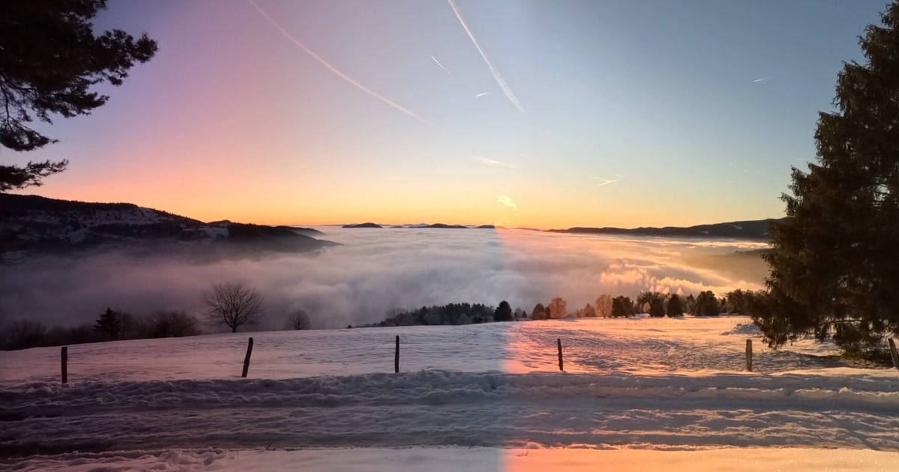

# chronotope



Turn a video into a single image of time — each column from a different
frame, all stitched into one picture. Decode, render, and encode all run
client-side; nothing is uploaded.

→ https://chronotope.acxx.workers.dev/

## Stack

- **React 19 + TypeScript + Vite** for the UI shell.
- **mp4box.js** parses the input MP4 into encoded chunks.
- **WebCodecs `VideoDecoder`** decodes those chunks into `VideoFrame`s.
- **WebCodecs `VideoEncoder` + `mp4-muxer`** re-encode the live composite
  canvas as an H.264/MP4 animation alongside the still image.

## Dev

```sh
pnpm install
pnpm dev      # http://localhost:5173/
pnpm build    # → dist/
```

## Notes from getting this working

- **Recorder profile**: H.264 baseline (`avc1.42E02A`) +
  `hardwareAcceleration: "prefer-software"`. Higher profiles pull in B-frames
  in `latencyMode: "quality"`, and mp4-muxer writes v0 ctts boxes that can't
  represent the negative PTS−DTS deltas B-frames produce.
- **Backpressure**: the recorder awaits `encodeQueueSize` and `onVizFrame`
  returns its promise so render.ts pauses between frames; without that the
  encoder errored mid-stream and the MP4 came out short.
- **finalize() ordering**: `acceptingInput` is flipped before
  `encoder.flush()` but `finalized` flips after, so output callbacks for
  the ~30 frames in the encoder pipeline still reach the muxer.

## Layout

```
src/
  App.tsx              UI, state machine, drop / pick / phase transitions
  lib/
    chronotope.ts      pure column → frame mapping
    decode.ts          mp4box.js + WebCodecs VideoDecoder
    render.ts          drives decode, paints chronotope + viz canvas
    recorder.ts        WebCodecs VideoEncoder → mp4-muxer
public/
  verdon.mp4           sample
  vosges_snow.mp4      sample
```
