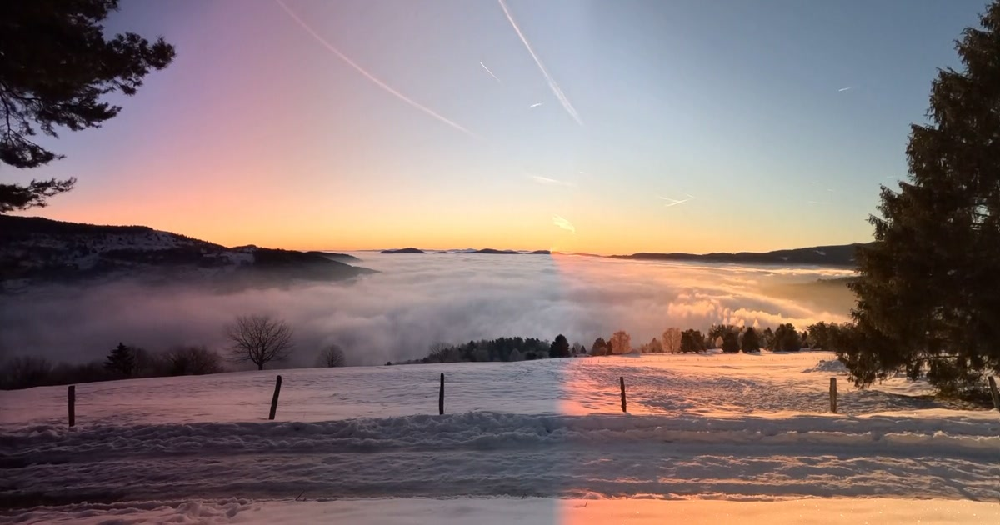

# chronotope



Turn a video into a single image of time — each column from a different
frame, all stitched into one picture. Decode, render, and encode all run
client-side; nothing is uploaded.

→ https://chronotope.acxx.art/

## Stack

- **React 19 + TypeScript + Vite** for the UI shell.
- **mp4box.js** parses the input MP4 into encoded chunks.
- **WebCodecs `VideoDecoder`** decodes those chunks into `VideoFrame`s.
- **WebCodecs `VideoEncoder` + `mp4-muxer`** re-encode the live composite
  canvas as an H.264/MP4 animation alongside the still image.

## Dev

```sh
pnpm install
pnpm dev      # http://localhost:5173/
pnpm build    # → dist/
```

## Notes from getting this working

- **Deflicker**: per-frame exposure/white-balance flicker in the source
  shows up as vertical banding (adjacent columns = adjacent frames), so
  each frame's level is matched to its temporal neighbours before
  slicing — the standard timelapse deflicker, with several twists
  learned from real GoPro footage:
  - per **channel** — about half the banding energy is white-balance
    flicker a luma-only gain can't touch;
  - per **horizontal strip** — local tone mapping flickers sky and
    ground almost independently (r ≈ 0.27 between them);
  - applied in **float precision** on the chronotope columns via
    getImageData/putImageData — typical corrections are ~0.4%, right at
    the 1/255 step canvas composite ops quantise to, so a composite-op
    gain literally rounds to a no-op. Preview/thumbnail surfaces use the
    cheap composite approximation (multiply / lighter self-draw, since
    iOS WebKit lacks `ctx.filter`);
  - a causal 10-frame window from **full-frame** levels during the
    streaming render (so the live build and recorded animation are
    already corrected — conservatively: full-width averaging keeps
    content motion from polluting the estimate), then a **two-pass
    polish** on the finished still: glare/AE episodes of 15-50 frames
    sail through any short causal window, so the whole measured series
    gets a robust trend fit (sliding median + mean) and each frame's
    columns are corrected to it — lag-free, and genuine long light
    changes (the sunrise itself) pass through untouched;
  - the two-pass target adds a **slice-local excess** term: levels are
    also logged in a window centred on the columns each frame actually
    contributes (interquartile mean, so the sun's disc doesn't drag the
    estimate), because lens glare around a rising sun is horizontally
    localised and invisible to full-frame levels. Only the temporally
    smoothed (±2 frames) part of the local-minus-global deviation is
    corrected: coherent glare episodes pass, frame-to-frame content
    noise (tree branches in the window) averages toward zero — on
    flicker-free footage the correction vanishes instead of injecting
    banding of its own.

- **Recorder profile**: H.264 baseline (`avc1.42E02A`) +
  `hardwareAcceleration: "prefer-software"`. Higher profiles pull in B-frames
  in `latencyMode: "quality"`, and mp4-muxer writes v0 ctts boxes that can't
  represent the negative PTS−DTS deltas B-frames produce.
- **Backpressure**: the recorder awaits `encodeQueueSize` and `onVizFrame`
  returns its promise so render.ts pauses between frames; without that the
  encoder errored mid-stream and the MP4 came out short.
- **finalize() ordering**: `acceptingInput` is flipped before
  `encoder.flush()` but `finalized` flips after, so output callbacks for
  the ~30 frames in the encoder pipeline still reach the muxer.

## Layout

```
src/
  App.tsx              UI, state machine, drop / pick / phase transitions
  lib/
    chronotope.ts      pure column → frame mapping
    decode.ts          mp4box.js + WebCodecs VideoDecoder
    render.ts          drives decode, paints chronotope + viz canvas
    recorder.ts        WebCodecs VideoEncoder → mp4-muxer
public/
  verdon.mp4           sample
  vosges_snow.mp4      sample
```
